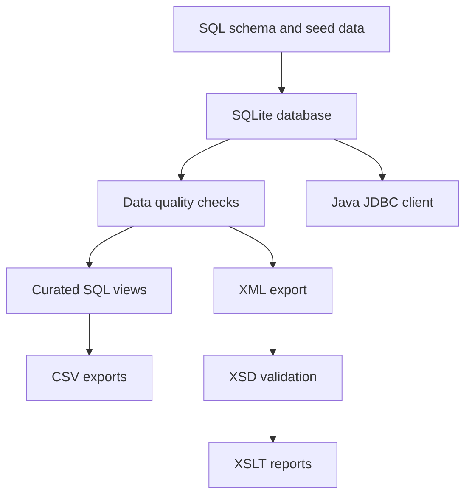
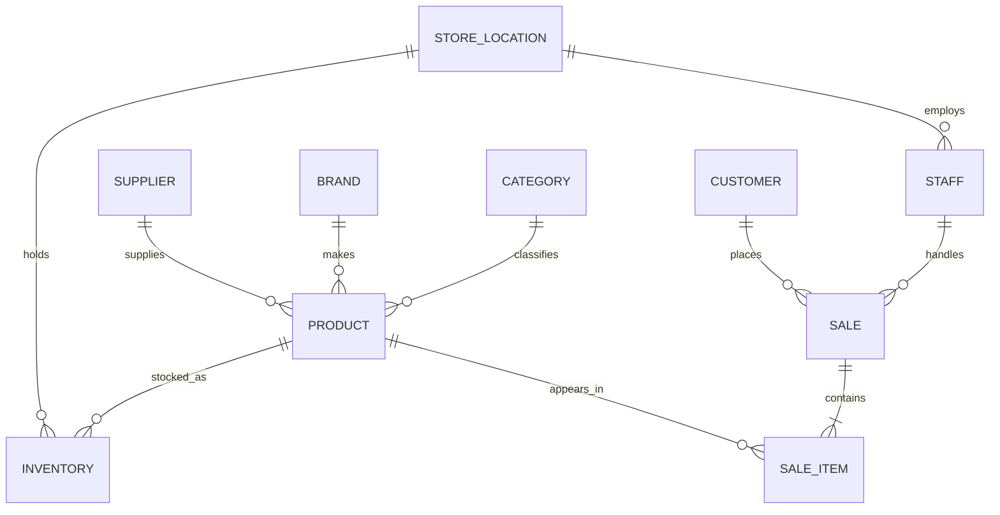

# Badminton Retail Data Pipeline

This project builds a small retail data platform from source SQL, validates the data, and publishes the results in several formats. The dataset tracks badminton products, suppliers, store locations, inventory, customers, staff, sales, and sale items.

The goal is not only to query a finished database. The full workflow can be recreated from an empty folder with one command. That makes the schema, seed data, quality rules, transformations, and reporting outputs easy to inspect and test.

## What the pipeline does

1. Creates a normalized SQLite database with 10 related tables.
2. Loads a consistent set of retail inventory and sales records.
3. Builds curated views for inventory, sales, and product performance.
4. Checks database integrity, foreign keys, required relationships, dates, and money values.
5. Exports analysis ready views to CSV.
6. Converts the relational data into a structured XML document.
7. Validates the XML document against an XSD with key and key reference constraints.
8. Produces five HTML reports with XSLT.
9. Runs automated tests locally and in GitHub Actions.
10. Provides a Java JDBC client for parameterized business queries.

## Pipeline flow



## Quick start

Python 3.10 or newer is required.

```bash
python3 -m venv .venv
source .venv/bin/activate
python3 -m pip install -e .
retail-pipeline --output-dir build
```

The command creates the following outputs:

| Output | Purpose |
| --- | --- |
| `build/badminton_retail.db` | Rebuilt SQLite database |
| `build/csv/inventory_status.csv` | Current stock status by product and location |
| `build/csv/product_performance.csv` | Units, revenue, and gross profit by product |
| `build/csv/sale_summary.csv` | Transaction totals with staff and customer context |
| `build/xml/badminton_retail.xml` | Relational data exported as XML |
| `build/reports/*.html` | Five business reports generated with XSLT |

Run the automated checks with:

```bash
python3 -m unittest discover -s tests -v
```

## Data model



The design uses business identifiers such as `PR001` and `SAL001` as stable keys. Inventory is unique for each product and location pair, so the same product can be stocked at more than one store. Transaction totals are calculated from sale items instead of stored twice.

Money is stored as integer cents. This avoids floating point rounding errors in financial calculations. Dates use ISO format and are checked by SQLite before a row can be inserted.

More detail is available in [Data model](docs/data_model.md) and [Engineering decisions](docs/engineering_decisions.md).

## SQL analysis

The query catalogue in [`sql/04_analytics.sql`](sql/04_analytics.sql) answers 12 practical questions, including:

1. Which products are below their reorder level?
2. Which products have never sold?
3. Which suppliers should be contacted for restocking?
4. What are the five best selling products in a selected period?
5. How much revenue came from equipment, apparel, and other products?
6. Which brand covers the most product categories?

The queries use joins, left joins, grouping, aggregation, conditional logic, date filters, parameters, common reporting views, and indexes that support the main access paths.

## Data quality rules

The pipeline stops before publishing outputs if a required check fails.

| Check | Reason |
| --- | --- |
| SQLite integrity | Detects database corruption |
| Foreign key integrity | Prevents orphan records |
| Expected table set | Detects incomplete builds |
| Inventory coverage | Confirms every product has a stock record |
| Sale item coverage | Confirms every sale contains at least one item |
| ISO date validation | Keeps dates sortable and comparable |
| Nonnegative money validation | Rejects invalid prices |
| XSD validation | Confirms XML types and references |

## Java client

The Java client uses JDBC and prepared statements to query the generated database. Maven downloads the JDBC dependency, so a jar file does not need to be committed to the repository.

Build the database first, then run a report from the project root:

```bash
cd java_client
mvn -q compile exec:java -Dexec.args="../build/badminton_retail.db inventory"
```

Reports are available for inventory alerts, top products by date range, average racquet price by brand, revenue groups, products with no sales, and supplier restocking.

Example with parameters:

```bash
mvn -q compile exec:java \
  -Dexec.args="../build/badminton_retail.db top-products 2026-01-01 2026-02-28"
```

## Repository guide

| Path | Contents |
| --- | --- |
| `sql/` | Schema, seed records, curated views, and analysis queries |
| `src/retail_pipeline/` | Database build, validation, export, and orchestration code |
| `xml/` | XSD contract and XSLT report definitions |
| `java_client/` | Java 17 JDBC query client and Maven configuration |
| `tests/` | End to end database and XML tests |
| `docs/` | Model details and engineering decisions |
| `.github/workflows/` | Continuous validation for every push and pull request |

Generated databases and reports are written to `build/`. They are intentionally excluded from Git because every output can be reproduced from the tracked source files.

## Scope

SQLite is a good fit for this project because the dataset is small and the repository can run without a database server. The same model can be moved to PostgreSQL when concurrent writes, larger volumes, or production access controls become necessary. A future version could add incremental ingestion, orchestration, and cloud storage, but those systems are outside the current implementation.
